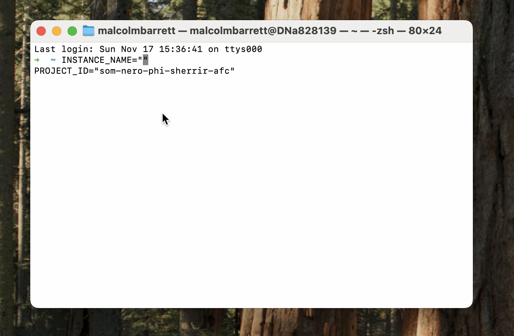
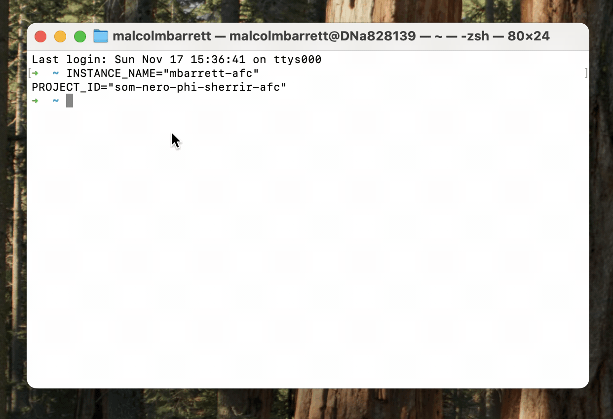
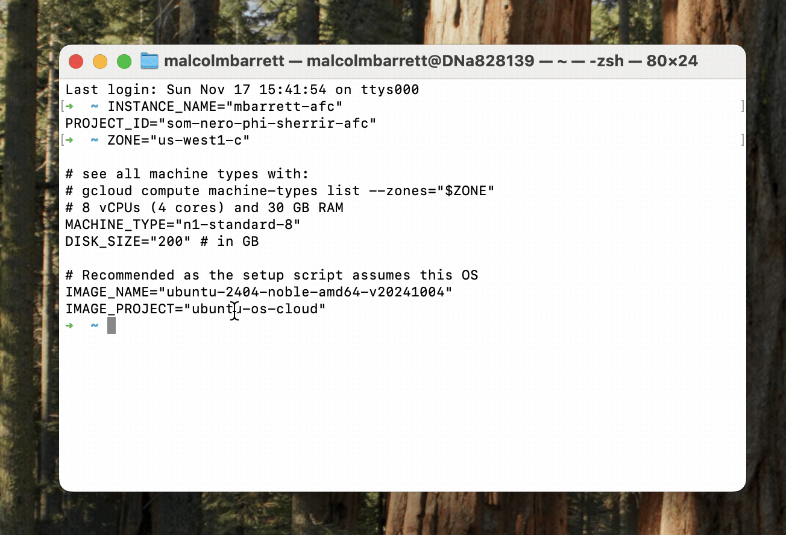
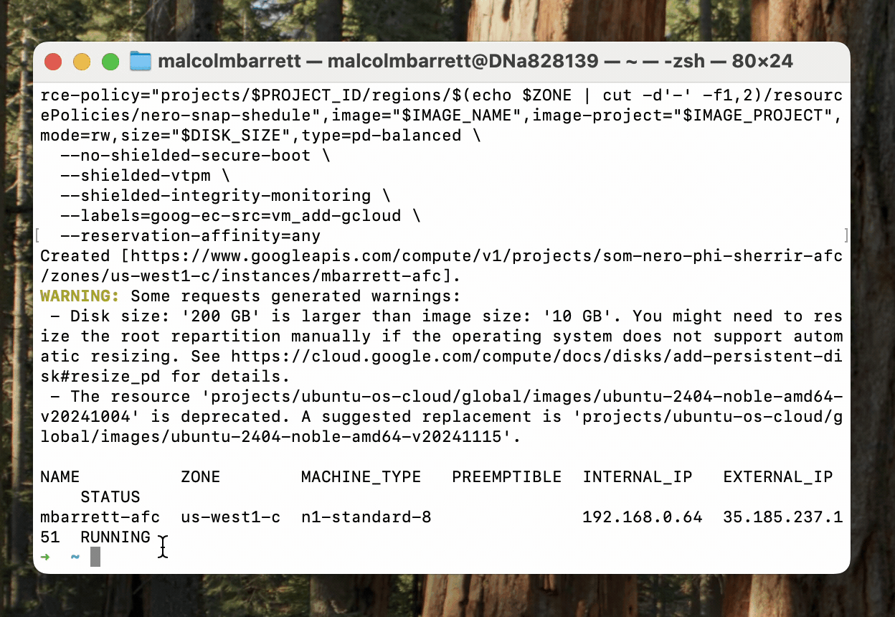
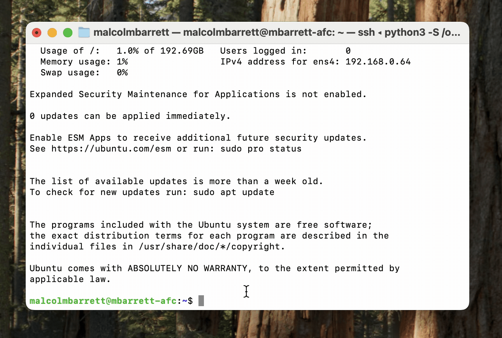
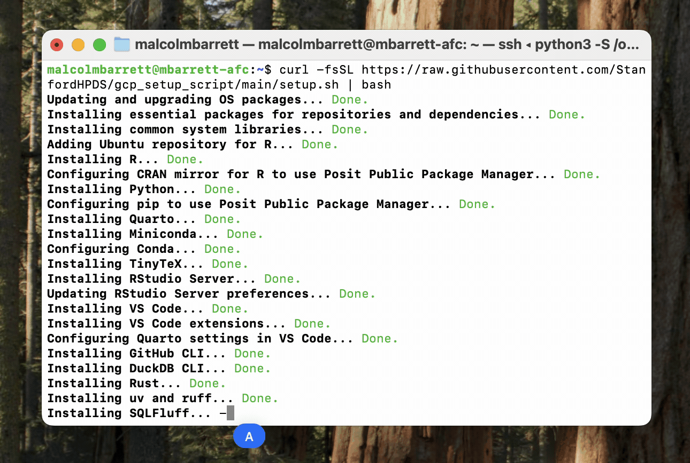
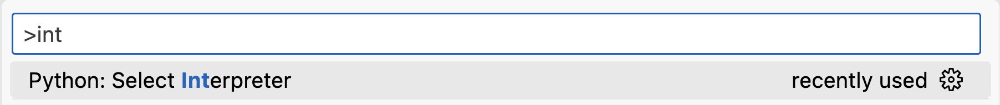
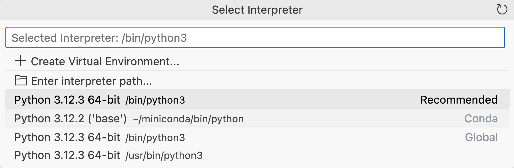

# Setting up a new Nero instance

<!-- badges: start -->
<!-- badges: end -->

This repository contains instructions for setting up a new Nero instance. First, you'll create a new instance with the [`gcloud`](https://cloud.google.com/sdk/docs/install) command. Then, you'll run a script to install and set up tools that we commonly use.

**NOTE**: These instructions are in bash and thus for Mac and Linux users. If you are a Windows user, you'll either need to adapt these instructions for PowerShell or use [Windows Subsystem for Linux (WSL)](https://learn.microsoft.com/en-us/windows/wsl/install).

For example, to create `my-instance` on the Nero project `som-nero-phi-my-project`, set the bash variables `INSTANCE_NAME` and `PROJECT_ID`:

```bash
# CHANGE THIS TO THE NAME YOU WANT FOR YOUR INSTANCE
INSTANCE_NAME="my-instance"
PROJECT_ID="som-nero-phi-my-project"
```



Additionally, set `ZONE`, `MACHINE_TYPE`, `DISK_SIZE`, `IMAGE_NAME`, and `IMAGE_PROJECT`, changing any values you want to adjust.

```bash
ZONE="us-west1-c"

# see all machine types with:
# gcloud compute machine-types list --zones="$ZONE"
# 8 vCPUs (4 cores) and 30 GB RAM
MACHINE_TYPE="n1-standard-8"
DISK_SIZE="200" # in GB

# Recommended as the setup script assumes this OS
IMAGE_NAME="ubuntu-2404-noble-amd64-v20241004"
IMAGE_PROJECT="ubuntu-os-cloud"
```



Then, run the `gcloud compute instances create` command below:

```bash
# Create instance with above specs
gcloud compute instances create "$INSTANCE_NAME" \
  --project="$PROJECT_ID" \
  --zone="$ZONE" \
  --machine-type="$MACHINE_TYPE" \
  --network-interface=network-tier=PREMIUM,stack-type=IPV4_ONLY \
  --maintenance-policy=MIGRATE \
  --provisioning-model=STANDARD \
  --scopes=https://www.googleapis.com/auth/devstorage.read_only,https://www.googleapis.com/auth/logging.write,https://www.googleapis.com/auth/monitoring.write,https://www.googleapis.com/auth/service.management.readonly,https://www.googleapis.com/auth/servicecontrol,https://www.googleapis.com/auth/trace.append,https://www.googleapis.com/auth/bigquery,https://www.googleapis.com/auth/cloud-platform \
  --tags=ssh \
  --create-disk=auto-delete=yes,boot=yes,device-name="$INSTANCE_NAME",image="$IMAGE_NAME",image-project="$IMAGE_PROJECT",mode=rw,size="$DISK_SIZE",type=pd-balanced \
  --no-shielded-secure-boot \
  --shielded-vtpm \
  --shielded-integrity-monitoring \
  --labels=goog-ec-src=vm_add-gcloud \
  --reservation-affinity=any
```

(Note: this gif has been trimmed, so creating the instance will likely take longer than in this clip.)



Note that it may take a moment for the server to initialize before you can connect. Then connect to the server via ssh with:

```bash
gcloud compute ssh --zone "$ZONE" "$INSTANCE_NAME" --project "$PROJECT_ID"
```



When you've successfully SSH'd into the server, run the installation script:

```bash
curl -fsSL https://github.com/StanfordHPDS/gcp_setup_script/releases/download/v1.2.1/setup.sh | bash
```



This process will take several minutes to run.

After the script has completed, log out and back in before using Docker without `sudo`. The setup installs the current hpds CLI and uses its complete server profile; it does not perform a blanket system upgrade or reboot the server.



Log back in with the ports for VS Code and RStudio open.

```bash
gcloud compute ssh --zone "$ZONE" "$INSTANCE_NAME" --project "$PROJECT_ID" \
  -- -L 8787:localhost:8787 -L 8080:localhost:8080
```

### Updating an existing instance

To update the software on an existing instance, SSH into your server and run:

```bash
curl -fsSL https://github.com/StanfordHPDS/gcp_setup_script/releases/download/v1.2.1/update.sh | bash
```

This updates hpds itself and then reconciles the complete server profile, including system libraries, Docker, R, Python, Quarto, TinyTeX, RStudio Server, code-server, and the command-line development tools. No reboot is required.

Use uv to manage Python versions on a per-project basis. See the [Using the instance](#using-the-instance) section below for more information.

You may also want to manage R on a per-project basis with rig and the `renv` package.

## Using the instance

We recommend stopping the instance when you are not using it to save costs.

### Software

Each instance has the most recent versions of Python and R available for Ubuntu 24. Both `pip` and `install.packages()` use [Posit Public Package Manager](https://posit.co/products/cloud/public-package-manager/) to install binaries for packages. Additionally, the instance has [Quarto](https://quarto.org/), [Docker](https://www.docker.com/), [ruff](https://docs.astral.sh/ruff/), [sqlfluff](https://sqlfluff.com/), [uv](https://docs.astral.sh/uv/), [duckdb](https://duckdb.org/), [gh](https://cli.github.com/), [TinyTeX](https://yihui.org/tinytex/), and [Rust](https://www.rust-lang.org/) installed, as well as a number of common system libraries used in data science packages.

If you think another tool should be included in the default setup, please file an issue or pull request.

### Git and GitHub

Authorize your GitHub credentials with

```bash
gh auth login
```

And tell git who you are

```bash
git config --global user.name "Jane Doe"
git config --global user.email "jane@example.com"
```

### gcloud and BigQuery

**You should be able to connect to BigQuery on the instance without authorization**. For new code, prefer connecting without explicit authorization.

However, if older code you are running expects a credentials file, you can create one with:

```bash
gcloud auth application-default login
```

Note where the file is created in case you need to reference it.

### Python Package Management with uv

We use [uv](https://docs.astral.sh/uv/) as our primary Python package manager. It's fast and automatically manages virtual environments. Here's how to use it:

```bash
# Create a new project
uv init my-project
cd my-project

# Pin a specific Python version (creates .python-version file)
uv python pin 3.12

# Add packages
uv add pandas numpy scikit-learn

# Run Python scripts
uv run script_name.py

# Run Quarto documents
uv run quarto render document.qmd
```

Each project automatically gets its own isolated environment—no manual activation is needed. The Python version is controlled by the `.python-version` file in your project directory.

To see available Python versions:
```bash
uv python list
```

### VS Code (Browser) (<http://localhost:8080/>)

VS Code should now be running. If you open <http://localhost:8080/>, you'll get a start up message that tells you where the credential file is. You can see the password with

```bash
cat /path/to/the/file/code-server/config.yaml
```

Make sure to replace the path with the path in the startup message.

The Python, Quarto, and Jupyter extensions are already installed.

We also recommend activating a Python interpreter for your session, ideally matching the uv environment for your project. This allows the different spaces (Quarto, IPython, etc.) to use the same Python interpreter.

First, use `CMD/CTRL + Shift + P` to open the command palette and search for the Python interpreter option from the Python extension.



Then pick the environment and interpreter you want. For uv projects, look for the `.venv` directory in your project folder.



### RStudio Server (<http://localhost:8787/>)

RStudio Server should now be running. You'll need to add a user for yourself. Run

```
sudo adduser your_username
```

and follow the prompts. Then, visit <http://localhost:8787/> and enter the credentials you just created.

RStudio is configured to run R in a [blank slate](https://rstats.wtf/source-and-blank-slates#always-start-r-with-a-blank-slate) by default.

### Connecting from Local IDEs

Instead of using the browser-based IDEs, you can connect your local VS Code or Positron to the instance via SSH.

First, set your default project and configure SSH for your GCP instances:

```bash
gcloud config set project "$PROJECT_ID"
gcloud compute config-ssh
```

This adds all your instances to `~/.ssh/config`. You can then connect using the hostname format: `instance-name.zone.project-id`.

Note that by default, GCP assigns emphemeral external IP addresses to instances. That means when you stop and restart an instance, it will likely get a new external IP address. To make this work whenever you restart your instance, you will need to edit the `~/.ssh/config` file:

1. Find your instance in the format `instance-name.zone.project-id`
2. Remove all but the `IdentityFile` fields
3. Add this command (replacing `YOUR_PROJECT_ID` and `YOUR_ZONE` with the appropriage project ID and zone, respectively)

  ```bash
    ProxyCommand gcloud compute ssh instance-name --command "nc 0.0.0.0 22" --project YOUR_PROJECT_ID --zone YOUR_ZONE
  ```

  Such that your config entry is something to the effect of

  ```bash
  Host instance-name.zone.project-id
    IdentityFile /Users/your_user_name/.ssh/google_compute_engine
    ProxyCommand gcloud compute ssh instance-name --command "nc 0.0.0.0 22" --project YOUR_PROJECT_ID --zone YOUR_ZONE
  ```

Then, in your local IDE:

**VS Code**: Use the build-in [SSH feature](https://code.visualstudio.com/docs/remote/ssh) to connect to the hostname in the config file generated by `gcloud`.

**Positron**: Use the built-in [Remote SSH feature](https://positron.posit.co/remote-ssh.html) to connect to the same hostname.

Both IDEs handle port forwarding automatically, giving you the same development experience as working locally. While they both include built-in SSH tools, they use different ones and so work slightly differently. See the documentation.

### Transferring data from buckets

[`gcloud storage`](https://cloud.google.com/sdk/gcloud/reference/storage) allows you to work with Cloud Storage, including buckets. To download data from a bucket, use [`gcloud storage cp`](https://cloud.google.com/sdk/gcloud/reference/storage/cp):

```bash
gcloud storage cp gs://name_of_bucket/path/to/data ~path/to/data/on/instance
```

## Modifying the instance

### Changing disk size

Find the name of the disk for your instance using gcloud:

```bash
gcloud compute disks list --project="${PROJECT_ID}"
```

Then, resize it with `gcloud compute disks resize`. For instance, to change the disk `your-disk-name` to be 234 GB, I would run this command:

```bash
gcloud compute disks resize your-disk-name --size=234GB --zone="${ZONE}"
```

See the [gcloud documentation](https://cloud.google.com/sdk/gcloud/reference/compute/disks/resize) for more details.

After you've resized, you may need to resize it on the instance, too. SSH into your instance, then run this command in the terminal for information on your disks:

```bash
df -h
```

If the disk doesn't have approximately the same size you resized to, run:

```bash
sudo resize2fs /name/of/disk
```

Where `/name/of/disk` is the name listed in `df -h`.

Run `df -h` again to confirm the disk is resized. You may need to stop and restart the instance for the changes to take effect.

### Changing the machine type

The default value for the `MACHINE_TYPE` is `"n1-standard-8"`, a machine that has 8 vCPUs (4 cores) and 30 GB RAM. You can change the machine type after creation by stopping the instance, running `gcloud compute instances set-machine-type`, and restarting the instance.

For instance, if `"n1-standard-8"` suits most of your needs but you occassionally need to do more intensive computation, you could temporarily change the instance to use `"n1-highmem-32"`, which has has 32 vCPUs and 208 GB RAM.

```bash
INSTANCE_NAME="your-instance-name"
ZONE="your-instance-zone"

# Example: Change to n1-highmem-32
NEW_MACHINE_TYPE="n1-highmem-32"

# Stop the instance
gcloud compute instances stop "$INSTANCE_NAME" --zone="$ZONE"

# Change the machine type
gcloud compute instances set-machine-type "$INSTANCE_NAME" \
  --zone="$ZONE" \
  --machine-type="$NEW_MACHINE_TYPE"

# Start the instance
gcloud compute instances start "$INSTANCE_NAME" --zone="$ZONE"
```

If you've set the machine type to a high-compute type for a temporary computation, be sure to change it back to the original one when you are done to save costs.
